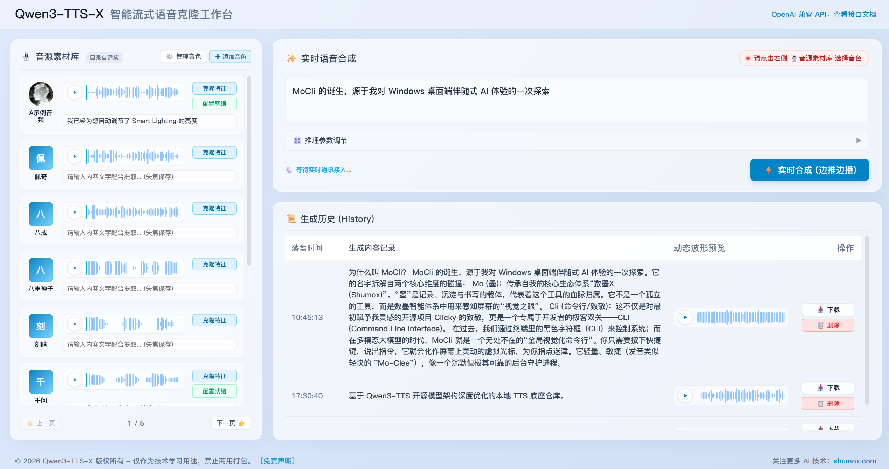
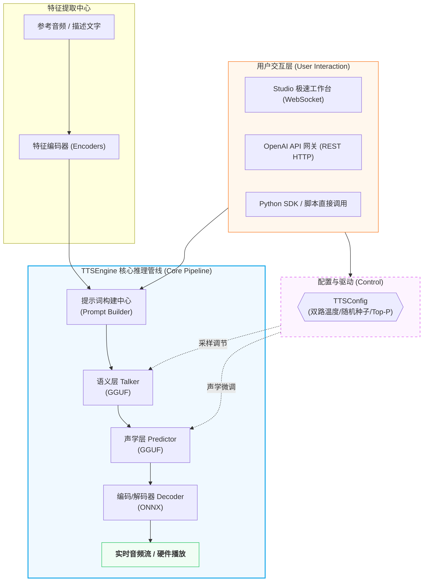

# Qwen3-TTS-X — 高性能本地流式语音合成引擎

> **实时流式克隆 · 全参数精调 · OpenAI 兼容 API · 专业可视化工作台**

<p align="center">
  
</p>

基于 Qwen3-TTS 开源模型架构深度优化的本地 TTS 底座仓库。通过 GGUF 量化 + ONNX 混合推理管线，在消费级 GPU 上实现**低于 300ms 首音延迟**的真流式语音合成。目前已实现**后端驱动与前端展示的一体化整合**，通过单一启动文件同时提供兼容 OpenAI 标准的 HTTP API 和支持全链路参数实时调节的专业 Web 工作台。

_(本项目持续更新发布于 [shumox.com](https://shumox.com) 官方主页)_

---

## 目录

- [核心特性](#核心特性)
- [系统架构](#系统架构)
- [性能指标](#性能指标)
- [项目结构](#项目结构)
- [环境要求与安装](#环境要求与安装)
- [服务组件与一键启动](#服务组件与一键启动)
- [TTSConfig 参数速查表](#ttsconfig-参数速查表)
- [使用示例](#使用示例)
- [音色克隆原理](#音色克隆原理)
- [常见问题 (FAQ)](#常见问题-faq)
- [联系方式](#联系方式)
- [授权说明](#授权说明)

---

## 核心特性

| 特性                    | 说明                                                                                          |
| :---------------------- | :-------------------------------------------------------------------------------------------- |
| ⚡ **极限流式合成**     | 真·边推边播，首音延迟最低压降至 **300ms** 以内，消灭等待"发呆"感                              |
| 🔗 **统一服务双路由**   | **全新整合！** 单体 `Qwen3-TTS-X.py` 即可同时拉起 Studio 界面与 `/v1` OpenAI 兼容 API         |
| 🎛️ **全参数精调面板**   | 双路 Temperature / Seed / Top-P / Top-K / Min-P / Repeat Penalty 等全链路采样参数前端实时可调 |
| 🔌 **OpenAI 标准兼容**  | 原生支持 `POST /v1/audio/speech`，改一行 `base_url` 即可无缝替换 OpenAI TTS 调用              |
| 🖥️ **专业可视化工作台** | 内置 WaveSurfer 波形预览、音色素材库管理、生成历史落盘、音频裁剪等完整工作流                  |
| 🔒 **并发安全**         | 异步显存串行锁 + 动态劫持播放队列 + 多重 finally 熔断，彻底消灭并发雪崩                       |
| 💾 **多后端加速**       | CUDA / Vulkan / DML / CPU 多后端兼容，除了 NVIDIA，AMD 显卡亦可启用 Vulkan 推理加速           |
| 📦 **极致量化**         | GGUF 量化 + ONNX 混合推理，1.7B 模型峰值仅需 **1.8 GB** 显存                                  |

---

## 系统架构



**推理管线分为两级采样阶段：**

- **Talker（大师 / 语义层）**：决定**说什么、怎么断句、语气节奏** — 控制语义特征生成
- **Predictor（工匠 / 声学层）**：决定**怎么发声、音色细节** — 将语义码扩展为 16 层声学码本

双路 Temperature + Seed 机制使两个阶段可独立调参，精准控制情绪张力与合成稳定性。

---

## 性能指标

以下数据基于 **RTX 2080Ti** 平台测定，30/40/50系显卡均可流畅运行，显存2G即可：

| 指标              | 数值        | 说明                           |
| :---------------- | :---------- | :----------------------------- |
| **RTF (实时率)**  | **0.21**    | 生成 1 秒音频仅需 0.21 秒      |
| **首音延迟 TTFB** | **< 300ms** | 流式模式下的首个音频块到达时间 |
| **显存峰值**      | **~1.8 GB** | 1.7B 模型全程推理              |
| **CPU RTF**       | ~1.3        | 纯 CPU 或集成显卡执行          |

> 💡 当 RTF < 1 时，引擎生成速度超越实际播放速度，实现绝对不断音的流式体验。

**模型规格对比：**

| 规格            | 显存节省  | 速度差异   | 建议                                                 |
| :-------------- | :-------- | :--------- | :--------------------------------------------------- |
| **1.7B** (推荐) | 无        | 基准       | 音质最优，推荐锁定此权重                             |
| 0.6B            | 约 -500MB | 提升不明显 | 瓶颈在 Predictor（187.5 次/秒迭代），Talker 差异有限 |

---

## 项目结构

```text
📦 qwen3-tts-x/
 ┣ 📂 model-base/                  # 模型权重目录，下载后把模型放这里
 ┣ 📂 qwen3_tts_gguf/              # 底层推理引擎核心代码
 ┃  ┗ 📂 inference/
 ┃     ┣ 📂 bin/                    # 从 llama.cpp Releases 下载预编译二进制，将 DLL 放入
 ┣ 📂 example_audio/               # 音色素材库（Studio 自动扫描）
 ┣ 📂 output/                      # 合成输出目录
 ┃  ┣ 📂 studio_history/            #   └ Studio 生成历史落盘
 ┃  ┣ 📂 clone/                     #   └ Clone 模式输出
 ┣ 📜 Qwen3-TTS-X.py               # ★ 一体化核心服务程序（含 Web UI + API）
 ┣ 📜 studio.html                  #   └ Studio 前端工作台界面
 ┣ 📜 pyproject.toml               # uv 包管理与依赖配置清单
 ┗ 📜 README.md                    # 本文档
```

---

## 环境要求与安装

### 环境要求

- **操作系统**：Windows / Linux
- **Python**：3.12+ 推荐
- **GPU（推荐）**：NVIDIA 显卡 + 正确配置的 CUDA 环境（≥ 1.8GB 显存）
- **包管理器**：以现代化的 `uv` 为主
- **可选**：AMD 显卡可通过 Vulkan 后端启用推理加速

### 安装步骤

#### 1. 下载 `llama.cpp` 预编译二进制组件

从 [llama.cpp Releases](https://github.com/ggml-org/llama.cpp/releases) 下载并将其动态库解压放入 `qwen3_tts_gguf/inference/bin/` 目录：

| 平台        | 下载文件                                   | 备注            |
| :---------- | :----------------------------------------- | :-------------- |
| **Windows** | `llama-bXXXX-bin-win-vulkan-x64.zip`       | 通用方案        |
| **Windows** | `llama-bXXXX-bin-win-cuda-12.4-x64.zip`    | NVIDIA 显卡优选 |
| **Linux**   | `llama-bXXXX-bin-ubuntu-vulkan-x64.tar.gz` | 可能需自行编译  |

> [!TIP]
> 另外还需全局安装 **FFmpeg** 并将其添加到系统环境变量，用于读取多媒体音频特征。

#### 2. 工具链配置与依赖安装

这里推荐使用 Rust 编写的极速包管理工具 `uv`。

```bash
# 1. 克隆项目
git clone https://git.aoun.ltd/llrrdb/qwen3tts-x && cd qwen3tts-x

# 2. 从官方安装 uv (如果你还未安装)
pip install uv

# 3. 自动同步并安装所有的项目依赖库 (从 pyproject.toml 读取)
uv sync

# 4. 最后，别忘了把下载好的模型权重资产放入到 model-base/ 目录中
```

### 核心依赖

| 包名                        | 用途                  |
| :-------------------------- | :-------------------- |
| `fastapi`                   | 异步 Web 框架         |
| `uvicorn`                   | ASGI 服务器           |
| `onnxruntime-gpu`           | ONNX 编码解码推理后端 |
| `gguf`                      | 二进制量化模型加载    |
| `sounddevice` / `soundfile` | 跨平台核心音频交互    |

---

## 服务组件与一键启动

我们在此版本做了极简整合演进！现在只需运行单个启动脚本即可享有两个服务环境。

```bash
uv run Qwen3-TTS-X.py
```

服务就绪后，默认监听 `8100` 端口。

### 🖥️ Studio — 可视化工作台

在浏览器访问：**`http://localhost:8100/`** 即可打开 Web 界面。

**核心功能：**

- 🎙️ **音源素材库**：自动扫描 `example_audio/` 下的音色资源，支持添加/删除/克隆特征
- 🎛️ **实时参数面容**：调节 Temperature / Seed / Top-P / Top-K / Min-P / Max Steps
- ⚡ **打字机特性**：WebSocket 边推边播，实时瀑布波形流图
- 📜 **生成历史保存**：自动记录到 `output/studio_history/`，生成 WAV 与配置文件 JSON
- ✂️ **音频裁剪**：添加音频时内置裁剪工具以保留有效参考发音

### 🔌 API 网关 — OpenAI 兼容端点

同一进程也在暴露以下被广泛采用的标准 API `/v1`，直接适配各种三方智能体：

| 端点               | 方法 | 说明                                |
| :----------------- | :--- | :---------------------------------- |
| `/v1/audio/speech` | POST | 流式语音合成（核心）                |
| `/v1/models`       | GET  | 列出可用模型（Mock）                |
| `/v1/health`       | GET  | 健康检查状态查询                    |
| `/docs`            | GET  | 包含各种请求格式的 Swagger 接口文档 |

**支持输出格式**：`wav`（标准文件头 + int16le PCM）、`pcm`（纯裸流数据），均为 24kHz 单声道。

---

## TTSConfig 参数速查表

在直接调用或者 Studio 环境均受这两个核心采样阶段配置接管：

### 大师阶段（Talker / 语义层）

决定**说什么、怎么断句、情绪基调**。

| 参数             | 类型  | 默认值 | 范围      | 说明                                           |
| :--------------- | :---- | :----- | :-------- | :--------------------------------------------- |
| `temperature`    | float | 0.9    | 0.0 - 2.0 | 温度越高 → 情感起伏越大；越低 → 越平铺直叙     |
| `top_p`          | float | 1.0    | 0.0 - 1.0 | 概率核采样阈值                                 |
| `min_p`          | float | 0.0    | 0.0 - 0.5 | 过滤低概率的长尾离群噪声，**可以防幻觉和电音** |
| `repeat_penalty` | float | 1.05   | 1.0 - 2.0 | 防复读，增加语气的随机自然态变化               |
| `seed`           | int   | None   | —         | 让语气、发声停顿与韵味能够稳定 100% 复现       |

### 工匠阶段（Predictor / 声学层）

决定**人声怎么发音、音色肌理、音质**。

| 参数              | 类型  | 默认值 | 说明                                                 |
| :---------------- | :---- | :----- | :--------------------------------------------------- |
| `sub_temperature` | float | 0.9    | 温度压低可以显著**减少说话时的抖动和不真实的电音感** |
| `sub_seed`        | int   | None   | 锁定声学上的细微肌理波纹参数（决定杂音/气息等）      |
| `sub_do_sample`   | bool  | True   | 设为 False 即可在最稳妥声学层面保证机械式无波动输出  |

### 推荐配置范例（开发者建议）

```python
# 稳定克隆态发音（不会突然大喜大悲的高可用状态）
config = TTSConfig(temperature=0.6, sub_temperature=0.6, seed=42, sub_seed=45)

# 极端抑制电音
config = TTSConfig(temperature=0.6, sub_temperature=0.4, min_p=0.05, repeat_penalty=1.1)

# 全随机放飞发音（适合有剧本演绎表达色彩的内容）
config = TTSConfig(temperature=1.2, sub_temperature=0.9, min_p=0.03)
```

---

## 使用示例

### Python SDK 流式合成调用

通过配置任何内置兼容了 OpenAI SDK 的包进行连接。

```python
from openai import OpenAI

client = OpenAI(base_url="http://localhost:8100/v1", api_key="not-needed")

# 只要触发请求即可达到立刻流入音箱
with client.audio.speech.with_streaming_response.create(
    model="qwen3-tts-x",
    voice="test1",
    input="你好，我是高度优化的本地流式合成一体机服务。"
) as response:
    response.stream_to_file("output.wav")
```

### 直接 Engine 级调用（用于底层脚本任务）

若你并非要以 WEB 形式架设，而是做独立工具也可直接调用内核方法。

```python
from qwen3_tts_gguf.inference import TTSEngine, TTSConfig

engine = TTSEngine(model_dir="model-base", onnx_provider="CUDA")
stream = engine.create_stream()

# 你可以给定原始音频来进行推算，或者提供之前落盘的 json 无损特征
stream.set_voice("output/elaborate/test1-voice.json")

config = TTSConfig(
    max_steps=400,
    temperature=0.6,
    sub_temperature=0.6,
    seed=42,
    sub_seed=45,
    streaming=True, # 允许打字机推送
)

result = stream.clone(text="直接从推理管线触发合成！", language="Chinese", config=config)

result.save("output_file.wav")    # 落盘音频
result.save("output_file.json")   # 若之前你是拿音频来参考，这里可将无损态序列存出供下次直接 load

# 清理管线与显存锁定
stream.join()
engine.shutdown()
```

---

## 音色克隆原理

声音克隆的本质是利用大语言模型的**上下文续写 (In-Context Learning)** 特性：

1. **投喂锚点**：将目标音色的参考音频编码为特征码（Code），以音频语言的格式注入到首端 Prompt 中
2. **续写生成**：模型被强行指定以既有的音调接着往后"说话"，最终继承了你的参考音频中的声带质感、说话习惯和鼻音特征
3. **双路径记录**：结果保存支持 `.wav`（用于听）和 `.json`（无损语言编码特征码字典），由于 JSON 未经过转换衰减，可作为**长效稳定的标准克隆锚点**

> 📌 **有损 vs 无损克隆**：如果每次使用 `.wav` 音频来让程序重新提取即为（有损克隆）；利用上一轮提出来的 `.json` 直接下发给模型处理即为（无损克隆），建议所有项目业务均锚向 JSON 文件。

---

## 常见问题 (FAQ)

**Q: 为什么抛弃官方原始的代码与实现？**  
**A:** 原始 PyTorch 推理流式策略实现成本太高，加载速度缓慢，且显存开销对普通用户往往成为一种负担。本项目通过 GGUF 原生 C/C++ 以及 ONNX 对齐进行架构性重组，带来了轻量且毫秒级的推演极致优化，它更偏重实用投产级别！

**Q: "流式"在你们的架构里指的是什么？**  
**A:** 很多人理解的流式是一边下发音频一边推到前端。实际上在这套核心机制下，**推理块（Chunk）在 GPU 第一声波纹算出的顷刻（200-300ms），即已交由 Web 或者 API 推送，在客户端扬声器发声此时甚至第二段文字依然还未进入预测队列**，我们实现了最绝对的流式首音下发。

**Q: 发音有抖动，感觉像机器人？**  
**A:** 调低 `sub_temperature`（推荐 0.4 到 0.6），开启 `min_p > 0.05`。可以有效限制多重采样的概率分叉以保障稳定的机械发声；甚至可以直接调整大核的 `seed` 固定模型表现态。

**Q: 这个包如果缺少 `sounddevice` 但是不想装呢？**  
**A:** 目前底座核心仍对音频播放和音频设备有调用关系依赖，未来有望将其解耦到扩展中。现在的推荐方案就是严格通过项目内部配置好的 `pyproject.toml` 用 `uv sync` 进行配置，就不会引起此类底层缺失错误了。

**Q: 其他未列出的问题或者 Bug 交流**  
**A:** 请直接跟进项目代码进行本地自纠，如果解决不了可联系微信号交流：B6688765。

---

## 授权说明

**仅限个人学习与技术研究用途，禁止商业使用。**

本项目中的源代码架构及运行逻辑代码，其初衷与愿景仅面向个人极客开发及小范围开源技术研究。明确禁止未经原作者授权，将本项目及其衍生产物打包至任何以营利为导向的商业发售、订阅方案或付费闭源服务中使用。

---

<p align="center">
  <sub>© 2026 Qwen3-TTS-X · Built with ❤️ for the open-source community</sub>
</p>
